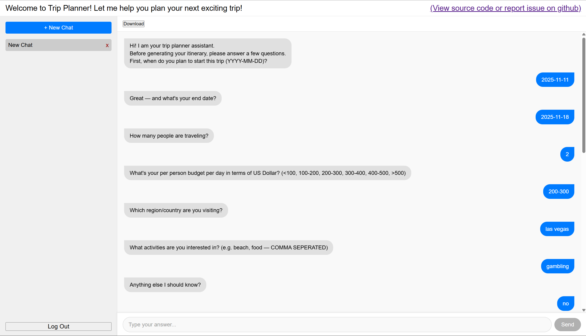
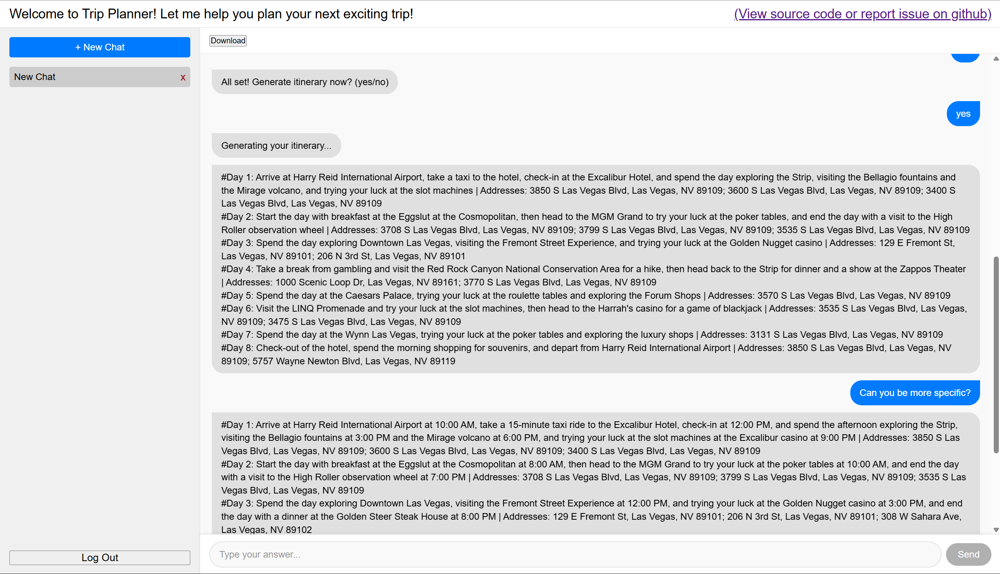
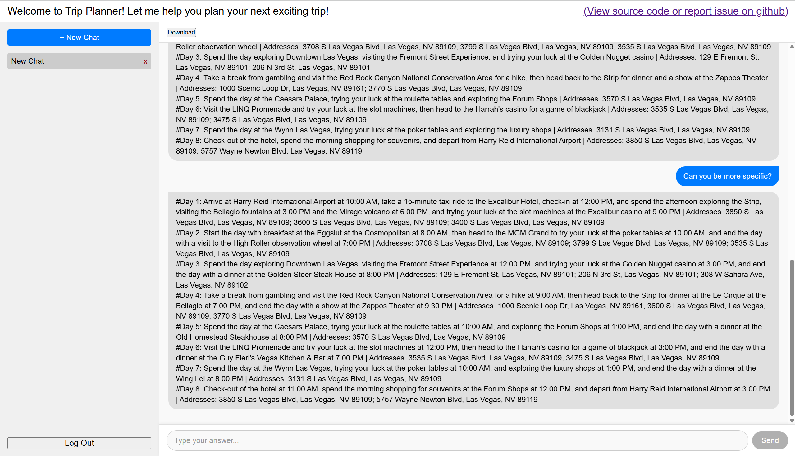

# Trip Planner
### Not sure how to plan out your next trip? This LLM-powered trip planner can help you build your itineraries.
http://tripplannerusa.com/ (No longer available)

## Getting Started (run locally)
### Clone the repo
```
git clone https://github.com/cyzhang39/trip-planner-chat.git
```
### Setting env variables
You will need a .env and a .env.frontend files under root directory.
#### .env
DB_USER and DB_PASSWORD must match APP_USER and APP_USER_PASSWORD in docker-compose.yml

```
RETRIEVE_URL=http://localhost:8001/retrieve

HF_KEY=<YOUR HF ACCESS TOKEN>
HF_BASE_URL=<HF MODEL URL>
HF_EMB_URL=<HF FEATURE EXTRACTOR URL>

DB_USER=apptester
DB_PASSWORD=apptesterpass
DB_HOST=db
DB_PORT=1521
DB_SERVICE=freepdb1

JWT_KEY=<STRONG SECRET KEY>
```

#### .env.frontend
```
REACT_APP_PORT=8000
APP_PORT=80
REACT_APP_API_ORIGIN=http://localhost:8000
```
### Docker
```
docker compose up --build
```
#### This will run a RAG service, chat service backend, and the application.  
#### RAG service: http://localhost:8001/docs  
#### Backend: http://localhost:8000/docs  
#### Application: http://localhost:3000  


## Screenshots Demo


